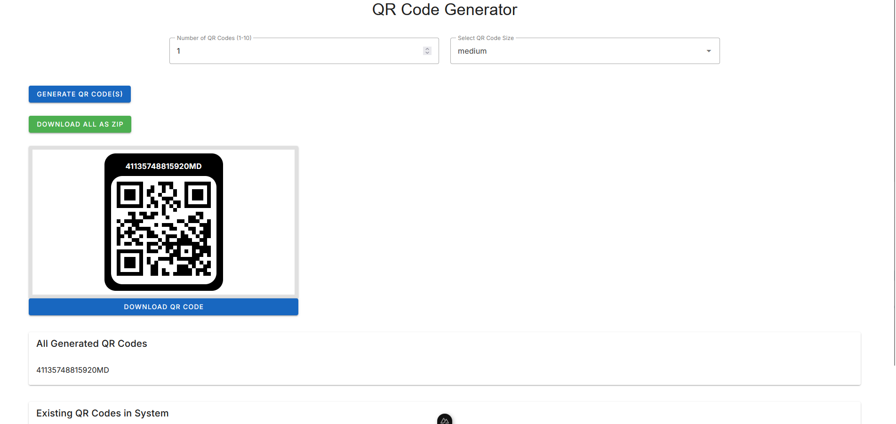

# QR Code Generator

This is a Vue 3 (Options API) project that allows users to generate QR codes, select their size, and download them either individually or in bulk as a ZIP file. The project uses Vuetify for styling, `qrcode.vue` for generating QR codes, `html2canvas` for capturing QR code images, `JSZip` for creating ZIP files, and `file-saver` for triggering downloads. The QR codes are generated as high-quality JPEG images with customizable sizes.

## Features
- Generate 1 to 10 QR codes at a time (14-digit QR codes).
- Select QR code size (3x3 cm to 8x8 cm).
- Display generated QR codes with a border and header (e.g., "QR123456789012").
- Dynamically scale the header text size based on the QR code size.
- Download individual QR codes as high-quality JPEG images.
- Download all generated QR codes as a ZIP file containing JPEG images.
- View a list of all generated QR codes and existing QR codes in the system.
- Responsive design using Vuetify.

## Prerequisites
Before you begin, ensure you have the following installed on your system:
- **Node.js** (v16 or later recommended) and **npm** (v8 or later). You can download them from [nodejs.org](https://nodejs.org/).
- A code editor like [Visual Studio Code](https://code.visualstudio.com/).

## Setup Instructions

### 1. Clone the Repository
Clone this repository to your local machine (or create a new project directory and copy the code into it):

```bash
git clone <repository-url>
cd qr-code-generator
```

If you don’t have a repository, you can create a new directory and initialize a `package.json`:

```bash
mkdir qr-code-generator
cd qr-code-generator
npm init -y
```

### 2. Create a Vue 3 Project
If you don’t already have a Vue 3 project, create one using the Vue CLI or `create-vue`:

```bash
npm create vue@latest
```

Follow the prompts to set up your project. Choose the following options:
- Project name: `qr-code-generator`
- Add TypeScript? No
- Add JSX Support? No
- Add Vue Router? No (unless you need routing)
- Add Pinia? No (unless you need state management)
- Add Vitest? No
- Add an End-to-End Testing Solution? No
- Add ESLint? Yes (optional, for linting)
- Add Prettier? Yes (optional, for code formatting)

This will create a new Vue 3 project in the `qr-code-generator` directory.

### 3. Install Dependencies
Navigate to your project directory (if not already there) and install the required dependencies:

```bash
cd qr-code-generator
npm install
```

Install the additional dependencies needed for this project:

```bash
npm install vuetify@latest @mdi/font qrcode.vue axios html2canvas jszip file-saver
```

### 4. Set Up Vuetify
Vuetify requires some configuration to work with Vue 3. Follow these steps:

#### Create a Vuetify Plugin
Create a file named `plugins/vuetify.js` in your project directory:

```javascript
// plugins/vuetify.js
import { createVuetify } from 'vuetify';
import 'vuetify/styles'; // Import Vuetify styles
import '@mdi/font/css/materialdesignicons.css'; // Import Material Design Icons

// Create Vuetify instance
const vuetify = createVuetify();

export default vuetify;
```

#### Update `main.js`
Modify your `main.js` file to use Vuetify:

```javascript
// main.js
import { createApp } from 'vue';
import App from './App.vue';
import vuetify from './plugins/vuetify'; // Import Vuetify

const app = createApp(App);
app.use(vuetify); // Use Vuetify
app.mount('#app');
```

### 5. Add the QR Code Generator Component
Create a file named `QRCodeGenerator.vue` in the `src/components` directory and add code in your dir:


### 7. Run the Development Server
Start the development server to run the project:

```bash
npm run dev
```

This will start the Vite development server (or Webpack, depending on your setup). Open your browser and navigate to the URL provided in the terminal (usually `http://localhost:5173`).

### 8. Test the Application
- Enter a number between 1 and 10 in the "Number of QR Codes" field.
- Select a size from the dropdown (e.g., 3x3 cm, 5x5 cm, 8x8 cm).
- Click "Generate QR Code(s)" to generate the specified number of QR codes.
- Observe that the header text size scales with the QR code size.
- Click "Download QR Code" on an individual card to download a single QR code as a high-quality `.jpg` file.
- Click "Download All as ZIP" to download a ZIP file named `qr-codes.zip` containing all QR codes as high-quality `.jpg` files.
- Check the lists for all generated QR codes and existing QR codes.

## Backend Integration
The project includes API calls to generate QR codes and fetch existing QR codes. You’ll need to replace the mocked API responses with your actual backend endpoints.

### API Endpoints
1. **Generate QR Codes**:
   - Endpoint: `/api/generate-qr?count=<number>`
   - Method: GET
   - Response: `{ "qrCodes": ["QR123456789012", "QR234567890123", ...] }`
   - Replace the mocked response in the `generateQRCodes` method:

     ```javascript
     const response = await axios.get(`/api/generate-qr?count=${this.qrCount}`);
     const newQRCodes = response.data.qrCodes;
     ```

2. **Fetch Existing QR Codes**:
   - Endpoint: `/api/existing-qr`
   - Method: GET
   - Response: `{ "qrCodes": ["QR123456789012", "QR987654321098", ...] }`
   - Replace the mocked response in the `fetchExistingQRCodes` method:

     ```javascript
     const response = await axios.get('/api/existing-qr');
     this.existingQRCodes = response.data.qrCodes;
     ```

### Mocked Responses
The current code uses mocked responses for testing. If you don’t have a backend ready, the mocked responses will generate random 14-digit QR codes and provide a static list of existing QR codes.

## Troubleshooting
- **Dependencies Not Found**:
  If you encounter errors about missing dependencies, ensure all packages are installed by running `npm install` again.
- **Vuetify Not Rendering**:
  Verify that the Vuetify plugin is correctly set up in `plugins/vuetify.js` and imported in `main.js`.
- **API Errors**:
  If the API calls fail, check your backend server and ensure the endpoints are correct. You can temporarily use the mocked responses for testing.
- **Download Issues**:
  If the downloads (individual or ZIP) fail, ensure `html2canvas`, `jszip`, and `file-saver` are installed and imported correctly.

## Notes
- **Performance**:
  Generating high-quality images (with `scale: 3` and `dpi: 300`) can be resource-intensive, especially for many QR codes. Consider adding a loading state (e.g., using Vuetify’s `v-progress-circular`) while images are being generated.
- **Size in cm**:
  The sizes (e.g., 3x3 cm) are mapped to pixel values for rendering. For actual cm sizes in the downloaded files, you’d need to handle DPI and physical dimensions (e.g., using `jsPDF` to create a PDF with precise measurements).
- **Customization**:
  You can customize Vuetify’s theme in `plugins/vuetify.js` to match your desired colors and styles.

## License
This project is licensed under the MIT License. Feel free to use and modify it as needed.

---

### Step 9: Add the `README.md` to Your Project
Create a file named `README.md` in the root of your project directory and copy the above content into it. This will provide clear instructions for anyone (including yourself) to set up and run the project.

### Step 10: Verify Everything Works
Follow the instructions in the `README.md` to ensure the project runs as expected. If you encounter any issues, the troubleshooting section should help you resolve them.

Let me know if you need further assistance!